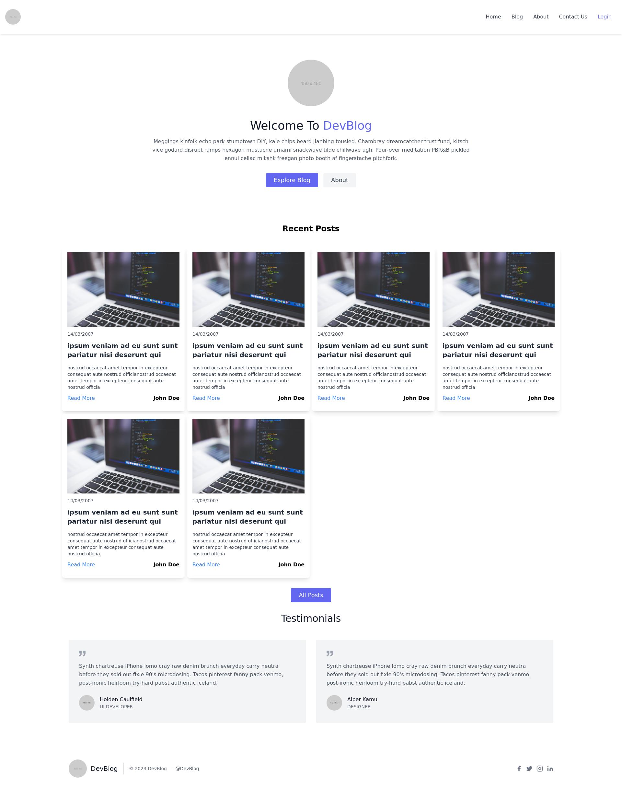

# 📝 A Blog Website Template Created using Tailwind CSS

[](https://github.com/your-username/your-repo-name/blob/main/LICENSE.md)
[](https://github.com/your-username/your-repo-name/issues)
[](https://github.com/Armanidrisi/tailwindcss_blog_template/stargazers)

🚀 A blog website template created using Tailwind CSS, a utility-first CSS framework. It includes a homepage, blog posts, about page and more, as well as a responsive design that looks great on all devices.

## 📷 Screenshots

### Homepage



[Live Preview](https://64568de1a0896447518ca331--peaceful-madeleine-e4cd4a.netlify.app/)

## 🛠️ Tools/Technologies Used

[](https://tailwindcss.com/)

[](https://vitejs.dev/)

[](https://postcss.org/)

[](https://tailblocks.cc/)

## 🚀 Getting Started

To get started with this project, simply clone the repository and run the following command to install the necessary dependencies:

```
npm install
```

Then run the following command to start the development server and begin making changes:

```
npm run start
```

For production build run:

```
npm run build
```

## 🎨 Features

- Responsive design that looks great on all devices
- Easily customizable using Tailwind CSS utility classes
- Lightweight and easy to use

## 📝 License

This project is licensed under the MIT License - see the [LICENSE](LICENSE) file for details.

## 🤝 Contributing

If you find any bugs or issues with the project, please feel free to open an issue or submit a pull request. All contributions are welcome!

## 📧 Contact

If you have any questions about the project, please feel free to reach out to me at idrisiarman19@gmail.com.
